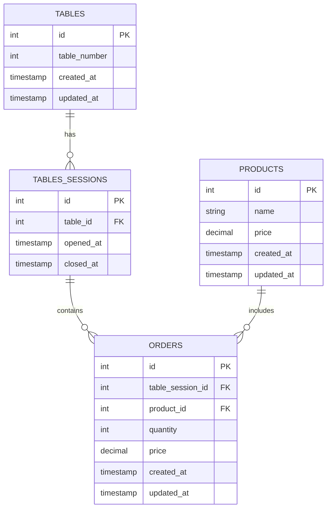

# 🍽️ Restaurant API

> **Uma API REST moderna para gerenciamento de pedidos de restaurante**

[](https://nodejs.org/)
[](https://www.typescriptlang.org/)
[](https://expressjs.com/)
[](https://knexjs.org/)
[](https://www.sqlite.org/)

## 📋 Sobre o Projeto

Esta API foi desenvolvida para facilitar o gerenciamento de pedidos em restaurantes, permitindo o controle completo de mesas, sessões de atendimento, produtos e pedidos. O sistema oferece uma solução completa para estabelecimentos que precisam de uma ferramenta digital eficiente para organizar seus serviços.

### ✨ Principais Funcionalidades

- 🏷️ **Gestão de Produtos**: CRUD completo com validação de dados
- 🪑 **Controle de Mesas**: Listagem e organização das mesas do restaurante
- 🕐 **Sessões de Mesa**: Abertura e fechamento de sessões por mesa
- 📝 **Gerenciamento de Pedidos**: Criação e consulta de pedidos por sessão
- 💰 **Cálculo Automático**: Total de pedidos por sessão de mesa
- 🔍 **Busca Inteligente**: Filtros por nome de produto
- ⚡ **Validação Robusta**: Usando Zod para validação de esquemas

## 🏗️ Arquitetura

```
src/
├── controllers/          # Lógica de negócio
├── database/
│   ├── migrations/       # Estrutura do banco de dados
│   ├── seeds/           # Dados iniciais
│   └── types/           # Definições TypeScript
├── middlewares/         # Middleware personalizado
├── routes/              # Definição das rotas
└── utils/               # Utilitários e classes auxiliares
```

### 🗄️ Modelo de Dados



## 🚀 Tecnologias Utilizadas

### Backend

- **Node.js** - Runtime JavaScript
- **TypeScript** - Superset tipado do JavaScript
- **Express.js** - Framework web minimalista
- **Knex.js** - Query builder SQL
- **SQLite** - Banco de dados relacional

### Validação & Tratamento

- **Zod** - Schema validation
- **Middleware personalizado** - Tratamento de erros

### Desenvolvimento

- **TSX** - TypeScript execution
- **ESLint + Prettier** - Code quality
- **Insomnia** - API testing

## ⚙️ Instalação e Configuração

### Pré-requisitos

- Node.js 18+
- npm ou yarn

### 1. Clone o repositório

```bash
git clone https://github.com/seu-usuario/restaurant-api.git
cd restaurant-api
```

### 2. Instale as dependências

```bash
npm install
```

### 3. Configure o banco de dados

```bash
# Execute as migrations
npm run knex migrate:latest

# Execute os seeds (dados iniciais)
npm run knex seed:run
```

### 4. Execute o servidor

```bash
npm run dev
```

A API estará rodando em `http://localhost:3333`

## 📚 Documentação da API

### 🏷️ Produtos

| Método   | Endpoint        | Descrição                                     |
| -------- | --------------- | --------------------------------------------- |
| `GET`    | `/products`     | Lista produtos (com filtro opcional por nome) |
| `POST`   | `/products`     | Cria novo produto                             |
| `PUT`    | `/products/:id` | Atualiza produto existente                    |
| `DELETE` | `/products/:id` | Remove produto                                |

**Exemplo de criação de produto:**

```json
POST /products
{
  "name": "Executivo de frango grelhado",
  "price": 36.50
}
```

### 🪑 Mesas

| Método | Endpoint  | Descrição            |
| ------ | --------- | -------------------- |
| `GET`  | `/tables` | Lista todas as mesas |

### 🕐 Sessões de Mesa

| Método  | Endpoint               | Descrição                |
| ------- | ---------------------- | ------------------------ |
| `GET`   | `/tables-sessions`     | Lista todas as sessões   |
| `POST`  | `/tables-sessions`     | Abre nova sessão de mesa |
| `PATCH` | `/tables-sessions/:id` | Fecha sessão de mesa     |

**Exemplo de abertura de sessão:**

```json
POST /tables-sessions
{
  "table_id": 3
}
```

### 📝 Pedidos

| Método | Endpoint                                        | Descrição               |
| ------ | ----------------------------------------------- | ----------------------- |
| `POST` | `/orders`                                       | Cria novo pedido        |
| `GET`  | `/orders/table-session/:table_session_id`       | Lista pedidos da sessão |
| `GET`  | `/orders/table-session/:table_session_id/total` | Total da sessão         |

**Exemplo de criação de pedido:**

```json
POST /orders
{
  "table_session_id": 2,
  "product_id": 31,
  "quantity": 2
}
```

## 🛡️ Validações e Tratamento de Erros

A API implementa um sistema robusto de validação:

- **Validação de schemas** com Zod
- **Tratamento centralizado de erros**
- **Validação de relacionamentos** entre entidades
- **Prevenção de operações inválidas** (ex: pedidos em sessões fechadas)

### Exemplos de Respostas de Erro

```json
// Produto não encontrado
{
  "message": "Product not found!"
}

// Sessão já fechada
{
  "message": "This table is closed"
}

// Erro de validação
{
  "message": "Validation error",
  "issues": {
    "price": {
      "_errors": ["Price must be greater than 0!"]
    }
  }
}
```

## 🎯 Funcionalidades Avançadas

### 💡 Regras de Negócio Implementadas

- ✅ **Controle de sessões**: Impede abertura de múltiplas sessões por mesa
- ✅ **Validação de pedidos**: Verifica existência de produtos e sessões ativas
- ✅ **Cálculo automático**: Preço salvo no momento do pedido para histórico
- ✅ **Total por sessão**: Agregação automática de valores e quantidades
- ✅ **Busca inteligente**: Filtro parcial por nome de produto

### 🔧 Comandos Úteis

```bash
# Desenvolvimento
npm run dev              # Inicia servidor em modo desenvolvimento

# Banco de dados
npm run knex migrate:make nome_migration  # Cria nova migration
npm run knex migrate:latest               # Executa migrations
npm run knex migrate:rollback            # Desfaz última migration
npm run knex seed:make nome_seed         # Cria novo seed
npm run knex seed:run                    # Executa seeds
```

## 📈 Próximos Passos

- [ ] Implementação de autenticação JWT
- [ ] Sistema de relatórios e dashboard
- [ ] API de notificações em tempo real
- [ ] Integração com sistemas de pagamento
- [ ] Dockerização da aplicação
- [ ] Testes automatizados (Jest)
- [ ] Deploy com CI/CD

## 🤝 Contribuição

Contribuições são sempre bem-vindas! Sinta-se à vontade para:

1. Fazer fork do projeto
2. Criar uma branch para sua feature (`git checkout -b feature/AmazingFeature`)
3. Commit suas mudanças (`git commit -m 'Add some AmazingFeature'`)
4. Push para a branch (`git push origin feature/AmazingFeature`)
5. Abrir um Pull Request

## 📄 Licença

Este projeto está sob a licença ISC. Veja o arquivo `package.json` para mais detalhes.

---

<div align="center">

**Desenvolvido com ❤️ por [Pedro Carvalho](https://github.com/seu-usuario)**

_Uma solução moderna para gestão de restaurantes_

</div>
